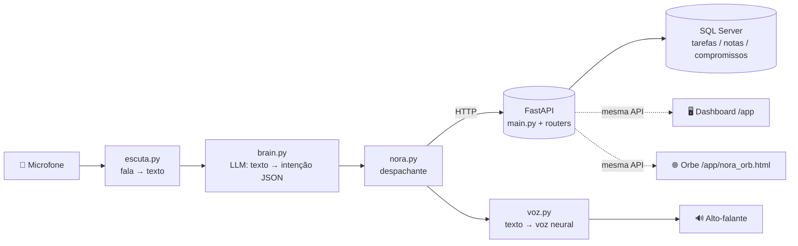

# 🎙️ Nora — Assistente Pessoal por Voz


A **Nora** é uma assistente pessoal que você controla **por voz**: você fala naturalmente,
um modelo de linguagem interpreta a intenção, e ela gerencia suas **tarefas, notas e compromissos**
num banco de dados — respondendo de volta com voz e personalidade própria.

O projeto também tem uma **API REST** documentada, um **dashboard web** e um **avatar neural** (orbe de dados)
que pulsa enquanto ela fala.

> Projeto de estudo/portfólio, construído "de dentro para fora": banco → API → voz → cérebro → interface.

---

## ✨ Funcionalidades

- 🗣️ **Comando por voz** (pt-BR): criar, listar, concluir e apagar tarefas; criar e listar notas;
  agendar e listar compromissos.
- 📅 **Datas naturais**: *"marca uma reunião amanhã às 15h"* vira uma data real (o cérebro recebe a data de hoje).
- 🧠 **Cérebro plugável (LLM)**: funciona com a **Groq** (online) ou **Ollama** (local), trocando uma variável de ambiente.
- 💬 **Personalidade**: a Nora conversa com um tom próprio (gentil, bem-humorada, mas eficiente), não só executa comandos.
- ✋ **Interrupção por voz (barge-in)**: se você começar a falar no meio de uma explicação longa, ela para e te escuta.
- 🎛️ **API REST (FastAPI)** com documentação automática em `/docs`.
- 🖥️ **Dashboard web** (`/app`) para ver e gerenciar tudo pelo navegador.
- 🌐 **Avatar "orbe de dados"** que gira e pulsa quando ela fala.

---

## 🏗️ Arquitetura

A Nora é dividida em camadas independentes — a voz, a API e o banco não sabem umas das outras,
conversam só por HTTP. Isso deixou fácil adicionar o dashboard e o avatar reaproveitando a mesma API.



| Camada | Arquivo(s) | Papel |
|---|---|---|
| Escuta (STT) | `escuta.py` | Captura o microfone e transcreve (Google Speech Recognition) |
| Cérebro (LLM) | `brain.py` | Interpreta a frase e devolve `{acao, ..., resposta}` em JSON |
| Despachante | `nora.py` | Decide qual função chamar e conversa com a API |
| Voz (TTS) | `voz.py` | Fala com voz neural (edge-tts) + interrupção por voz |
| API REST | `main.py`, `routers/` | CRUD de tarefas, notas e compromissos |
| Banco | SQL Server | Persistência dos dados |
| Interface | `static/` | Dashboard (`index.html`) e avatar (`nora_orb.html`) |

---

## 🧰 Tecnologias

**Python** · **FastAPI** · **Uvicorn** · **Pydantic** · **SQL Server** (via `pyodbc`) ·
**edge-tts** (voz neural) · **SpeechRecognition** + **sounddevice** (microfone) ·
**Groq / Ollama** (LLM) · **HTML/CSS/JS + Canvas** (interface e avatar).

---

## 📁 Estrutura

```
AssistenteNora/
├── README.md
├── schema.sql              # cria o banco e as tabelas
└── api/
    ├── main.py             # FastAPI: CORS, routers e serve a interface em /app
    ├── db.py               # conexão com o SQL Server
    ├── models.py           # modelos Pydantic (validação)
    ├── routers/            # endpoints REST (tarefas, notas, compromissos)
    ├── escuta.py           # microfone → texto
    ├── brain.py            # texto → intenção (LLM)
    ├── voz.py              # texto → voz neural (+ barge-in)
    ├── nora.py             # o assistente: ouve, decide, age e responde
    ├── static/             # dashboard web e avatar (orbe)
    ├── requirements.txt
    └── .env.example        # modelo das variáveis de ambiente
```

---

## 🚀 Como rodar

### Pré-requisitos
- Python 3.12+
- **SQL Server** (ex.: SQL Server Express) e o **ODBC Driver 17 for SQL Server**
- Uma chave da **Groq** (grátis em https://console.groq.com) — ou **Ollama** instalado localmente

### Passos
```bash
# 1. clonar
git clone <url-do-repo>
cd AssistenteNora/api

# 2. ambiente virtual
python -m venv venv
venv\Scripts\activate        # Windows
# source venv/bin/activate   # Linux/Mac

# 3. dependências
pip install -r requirements.txt

# 4. banco de dados
#    rode o schema.sql (na raiz do projeto) no seu SQL Server
#    e ajuste a string de conexão em db.py (SERVER=...)

# 5. variáveis de ambiente
copy .env.example .env       # Windows  (cp no Linux/Mac)
#    edite o .env e coloque sua GROQ_API_KEY

# 6. subir a API
uvicorn main:app --reload
#    docs:      http://127.0.0.1:8000/docs
#    dashboard: http://127.0.0.1:8000/app
#    avatar:    http://127.0.0.1:8000/app/nora_orb.html

# 7. em outro terminal, iniciar a assistente por voz
python nora.py
```

Exemplos de comandos de voz: *"anota que preciso ligar pro dentista"*, *"quais são minhas tarefas?"*,
*"marca uma reunião amanhã às 15h"*, *"me explica o que é uma API"* (e interrompa no meio!), *"quem é você?"*.

---

## 🗺️ Roadmap

- [ ] Unir avatar + voz neural (endpoint `/falar` servindo o áudio para o orbe pulsar pela amplitude real)
- [ ] Ativação por palavra-chave ("Nora!")
- [ ] Integrações para agir no sistema (abrir apps, buscar na web, etc.)
- [ ] Empacotar como aplicativo de desktop
- [ ] Testes automatizados

---

## 📝 Notas

- O `.env` (com a chave da API) **não** vai para o repositório — veja `.env.example`.
- Projeto em evolução, feito para estudo e portfólio. Sugestões e críticas são super bem-vindas!
